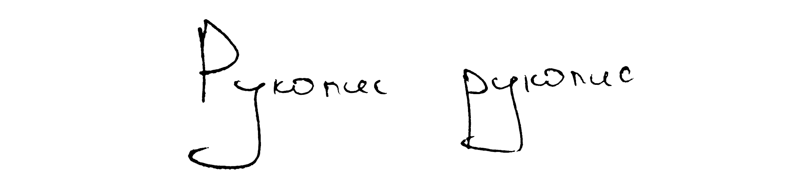

# Rukopys dataset

This dataset contains ~1k (so far) Ukrainian handwritten symbols in PNG format, 200x200 size. You may find them listed in `glyphs.csv` with following headers used:

* _string_ `label`: lowercase cyryllic character, which represents the picture.
* _string_ `transliter_kmu2010`: transliteration of the `label` according to the Resolution of the Cabinet of Ministers of Ukraine on 27 January 2010. You may find the transliteration table [here](https://www.ukrainianlanguage.org.uk/read/reference/translit.htm). `'` symbol is used for soft sign. Both _и_ and _й_ represented as `y` in this system, so better don't use it for hashing.
* _string_ `name`: unique name of this symbol. `soft_sign` is used for soft sign.
* _bool_ `is_uppercase`: determine case of the letter.
* _category_ `type`: one of `italic` or `printed`. There are two types of cyryllic handwriting: italic (_курсив_) plus one which imitates printed serif symbols (_друковані літери_).
* _category_ `is_alternate`: determine whether some less used manner of writing was used.
* _number_ `top`, `bottom`, `left`, `right`: precise boundaries of the glyph on the 200x200 picture in pixels. You may need these numbers in case you want to crop images.
* _number_ `height`, `width`: size of the glyph in pixels.
* _string_ `filename`: address to the picture in format `glyphs/[name]-[number].png`.

## Things to do

Following things should appear in the future:
- [ ] Set of all ~~✔️ lowercase~~ and uppercase italic letters
- [ ] Alternate forms and handwritten printed letters
- [ ] Possible couplings between letters

## How to contribute

My respect for those who reached this paragraph. In order to contribute, you may do the following:

- Write bunch of letters on a piece of paper.
- Make a clear well-ligthed shot.
- Open it with your favorite editor (like GIMP or Photoshop).
- Tune brighness/contrast and apply threshhold to the photo. Your photo should contain only black and white pixels.
- Crop the letters and put them onto white canvas of 200x200 size.
- Add to `glyphs/` folder named as `[letter name]-[number of the last letter + 1].png`.
- Add to `glyphs.csv`.
- Send me a pull request.

**If that looks complicated to you**, [here's](https://colab.research.google.com/drive/15w4LDj0nYpMzpJZ0mygHzveDslZHM0G_?usp=sharing) how I did it. It's as simple as few clicks. Feel free to use my notebook and add any comments.
